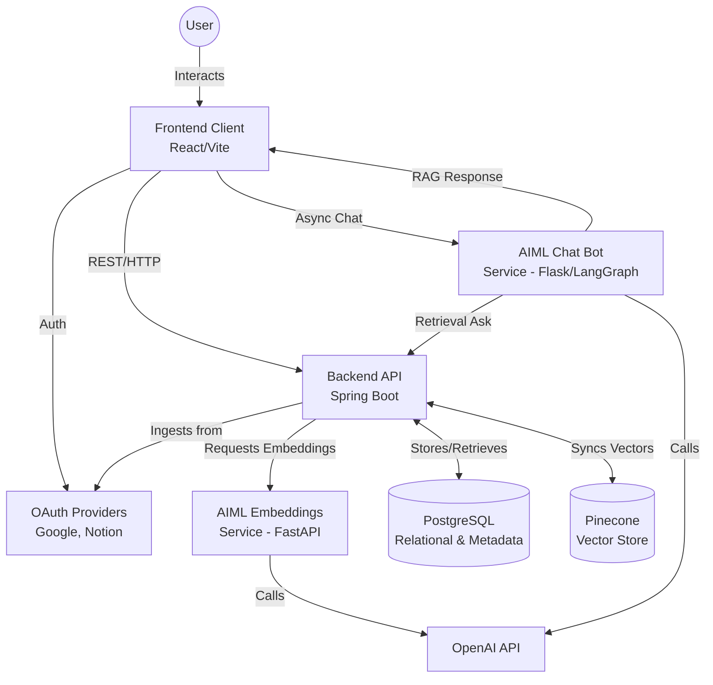

# Second Brain - Detailed System Design Document

## 1. Overview
Second Brain is a next-generation personal knowledge management system designed to consolidate, analyze, and interlink notes from a variety of disparate platforms (e.g., Notion, Google Docs). By centralizing these sources into an explorable knowledge graph and layering on an AI-powered conversational interface, it enables users to seamlessly retrieve past ideas, discover tangential relationships, and interact directly with their own accumulated knowledge.

## 2. Background
Knowledge workers continuously capture ideas, notes, and references across a multitude of applications. This fragmentation creates several core problems:
- **Silos of Information:** A thought captured in Notion is rarely connected to a related document residing in Google Drive.
- **Low Discovery and Recall:** Information is often captured once and forgotten, leading to duplicated effort or lost insights.
- **Lack of Synthesis:** Traditional search mechanisms rely on keyword matching, failing to understand the semantic intent or the overarching relationships between different pieces of knowledge.

Second Brain shifts the paradigm from simple "storage and search" to "ingestion, connection, and conversation." 

## 3. Goals
- **Unified Ingestion:** Provide mechanisms to systematically ingest data from popular platforms (Google Drive, Notion).
- **Semantic Understanding:** Automatically compute embeddings for ingested content to enable semantic similarity search and relationship discovery.
- **Graph Representation:** Model the ingested data as a connected graph of chunks and documents to facilitate exploration.
- **AI-Powered Retrieval:** Offer a conversational interface (Chat API) grounded explicitly in the user's data (Retrieval-Augmented Generation) to prevent hallucinations.
- **Independent Scalability:** Decouple ingestion, AI processing, and client presentation to allow independent scaling and deployment of services.

## 4. Non-Goals (v1)
- Team workspaces, shared permissions, and collaborative multitenant editing mechanisms.
- An extensive ecosystem of connectors outside of Google Docs/Drive and Notion.
- Strong real-time consistency guarantees across all external integrations (eventual consistency via batch sync is acceptable).
- Complex analytics or visualization dashboards beyond basic note graph representations.

## 5. High-Level Design (HLD)

### 5.1 System Architecture Diagram

### 5.2 System Components
1. **Frontend (Vite + React):** Responsible for user interaction, including OAuth login flows, graph visualization of connected notes, and the chat interface. Proxies API requests to the Backend.
2. **Backend (Spring Boot / Java 17):** The central orchestrator. It handles ingestion logic, parses external API responses, manages the core relational structures (Users, Tokens, Nodes, Edges), coordinates the creation of chunks, and acts as the gateway to the vector store (Pinecone).
3. **AIML Embeddings Service (Python / FastAPI):** Focused computational node. Exposes endpoints to batch-calculate OpenAI embeddings and score semantic relationships between text chunks.
4. **AIML Chat Service (Python / Flask + LangGraph):** The conversational agent. It manages chat completion cycles. When a user queries it, it reaches out to the Backend (`/api/graph/ask`) to fetch retrieval data (Citations), formats a grounded response, and returns it.
5. **PostgreSQL:** The primary source of truth. Stores relational user data, synchronized text content, document metadata, and explicit graph edge connections.
6. **Pinecone (Vector Store):** Specialized storage for 1536-dimensional embeddings, allowing rapid k-NN (k-nearest neighbors) retrieval when a user queries the semantic space.

### 5.3 Data Model
The PostgreSQL schema focuses on managing users, their integrations, and a normalized view of the knowledge graph.

- **User / Tokens:** Tracks user identities and their OAuth tokens for Google/Notion.
- **Document (Note):** Represents an overarching file from an external system. Contains Title, Source System ID, Timestamps, and Raw Text.
- **Chunk:** Documents are split into semantic chunks (e.g., paragraphs or sliding windows). A Chunk contains chunk text, sequence ID, and links to a Document.
- **Edge (Relation):** Explicit relationships computed between Chunks or Documents. Could be user-defined or semantically inferred. Contains Source ID, Target ID, Weight (Cosine Similarity), and Type.

### 5.4 Architecture Decisions
- **Decision 1: Polyglot Microservices.** Using Spring Boot for the core API allows leveraging Java's robust transaction management, OAuth tooling, and JPA paradigms. Python is used for AI/ML to tap directly into native libraries (LangGraph, standard OpenAI SDKs) and provide faster iteration on prompts/models.
- **Decision 2: Dual-Storage Strategy.** PostgreSQL handles ACID transactions and graph relational mappings. Pinecone is exclusively used for similarity search. Synchronization between the two is eventual.
- **Decision 3: Retrieval-First Chat (Strict RAG).** The `CHAT_REQUIRE_RETRIEVAL` toggle mandates that the AI refuses to answer questions if no relevant notes are retrieved from the index, strictly minimizing LLM hallucinations.

---

## 6. Detailed Design

### 6.1 Ingestion Pipeline Service
1. **Trigger:** A sync event is fired (manual or scheduled) via the Backend API.
2. **Fetch:** The Spring Boot API utilizes stored OAuth tokens to fetch recently modified documents from the Notion API and Google Drive API.
3. **Normalization:** Structured data (HTML, Blocks) is stripped and flattened into raw Markdown or plain text.
4. **Chunking Strategy:** The document is passed through a chunker (e.g., overlapping text windows of 512 tokens) to preserve context.
5. **Embedding Generation:** The Backend makes an HTTP POST to the `AIML Embeddings Service` (`/embeddings`) with batches of chunks. The Python service calls OpenAI and returns the vector arrays.
6. **Persistence:** The Backend saves the chunks in PostgreSQL and upserts the vectors into the Pinecone namespace, storing the Chunk UUID as the vector ID.

### 6.2 Semantic Relationship Generator (Edge Creation)
To preemptively make the graph explorable, an asynchronous background job evaluates new chunks against the existing Pinecone database.
- It queries Pinecone for the top `K` (e.g., top 8) most similar chunks based on a `SEMANTIC_THRESHOLD` (e.g., 0.45).
- For matching chunks that exceed the threshold, an `Edge` record is created in PostgreSQL with `type = SEMANTIC` and the corresponding weight.

### 6.3 Chat and Retrieval Orchestration
1. User sends a query `{ "message": "What did I write about System Design?" }` to the AIML Chat service on port 8002.
2. The Chat service intercepts the message. Using LangGraph, it decides it needs external context.
3. It makes an HTTP request to the Backend `BACKEND_ASK_URL` (`/api/graph/ask`).
4. The Backend receives the query string, converts it to an embedding (via the Embeddings service), and conducts a vector search on Pinecone.
5. The top relevant chunks are pulled from Pinecone, re-hydrated with their Document titles and URLs from PostgreSQL, and sent back to the Chat service.
6. The Chat service synthesizes these chunks via the `gpt-4o-mini` model, ensuring inline citations. It returns the response payload payload to the client.

---

## 7. Alternative Approaches Considered

### 7.1 Single Monolith (Python or Java Only)
- **Description:** Run all ingestion and AI logic inside entirely Spring Boot or fully inside a FastAPI Python app.
- **Why Rejected:** Java's AI ecosystem (LangChain4j) is maturing but still lags behind Python for cutting-edge rapid prototyping (LangGraph). Conversely, writing complex OAuth, database migrations, and concurrent ingestion pipelines is much more robust in Spring Boot than in Flask/FastAPI. The polyglot approach maximizes the strengths of each ecosystem.

### 7.2 Native Vector Capabilities in Postgres (pgvector)
- **Description:** Instead of Pinecone, install the `pgvector` extension on the core PostgreSQL database.
- **Why Rejected:** While `pgvector` simplifies operational overhead (one less database), a managed service like Pinecone provides lower latency for concurrent queries out of the box at higher dimensional scales without requiring complex database index tuning and vertical scaling of the Postgres instance.

---

## 8. Risks and Mitigations

| Risk | Impact | Mitigation |
|------|--------|------------|
| API Rate Limiting | External platforms (Notion, Google Drive, OpenAI) rate-limit ingestion spikes. | Implement exponential backoff algorithms during ingestion. Use batch APIs for OpenAI embeddings. |
| Stale Embeddings | Vector DB goes out of sync with Postgres core metadata after document deletions. | Include an event-driven `delete-cascade` mechanism. When a document is archived in Postgres, push an async event to delete matching vector IDs in Pinecone. |
| LLM Hallucinations | Chat replies with convincing but fabricated answers not in the user's notes. | Strongly enforce `CHAT_REQUIRE_RETRIEVAL=true`. Instruct the LangGraph prompt template to strictly output "I don't know" if no citations are provided. |
| Secret Management | OAuth credentials and API keys leak into source control. | Strictly rely on `.env` injection. Exclude `.env` via `.gitignore`. Document clear setup instructions for secure local variables. |

---

## 9. Non-Functional Requirements (NFRs)

- **Scalability:** Front-end and Chat services are completely stateless and can scale horizontally entirely based on request load. The backend can scale out, but requires distributed locking for ingestion jobs to prevent duplicate syncing.
- **Performance:** Chat payload responses should begin streaming or return within 3-5 seconds. Vector retrieval latency should be < 100ms.
- **Security:** In-transit data encrypted via TLS. User boundaries are enforced via JWTs / Sessions from the Frontend to the Backend at every API endpoint. Chunks mapped strictly to the owning user ID.
- **Deployability:** Provided `docker-compose.yml` ensures development parity with production. The application requires less than 2GB of RAM to run locally (excluding external databases).

---

## 10. Future Evolution
As the Second Brain scales, the architecture will naturally evolve to encompass:
- Incremental Syncs using webhook callbacks from Google Drive/Notion rather than polling.
- Proactive memory resurfacing via timed background jobs.
- Explainable AI edges that not only link notes but provide an LLM-generated description of *why* two documents relate to one another.
