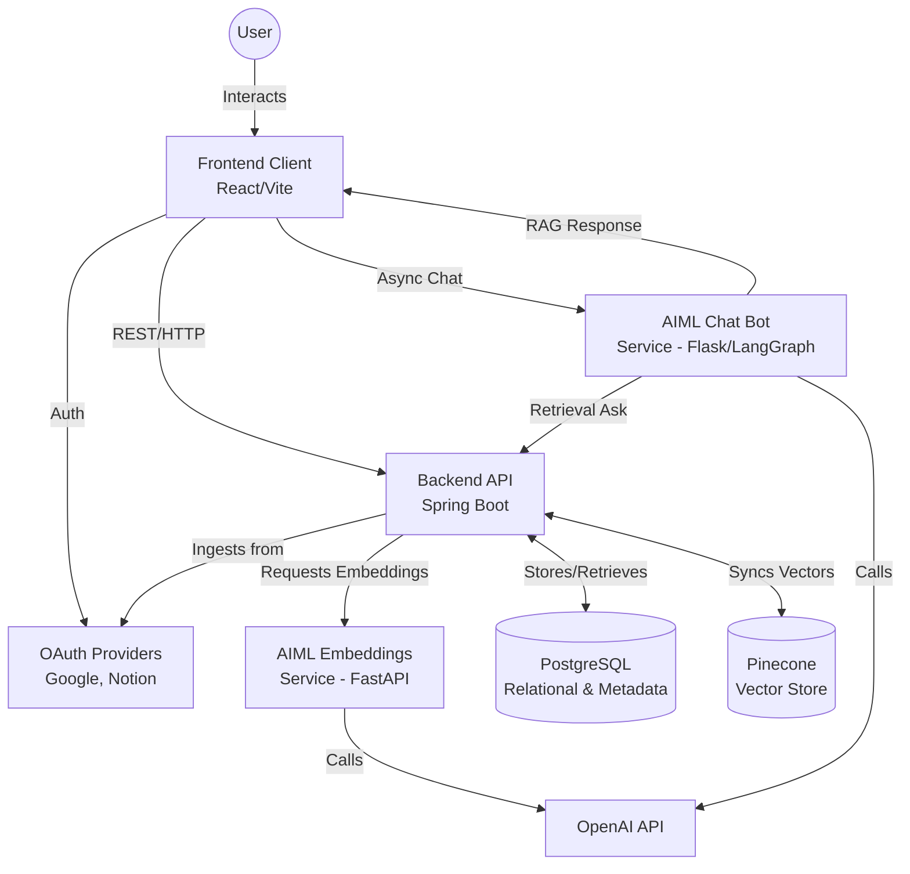

# Second Brain - Detailed System Design Document

## 1. Overview
Second Brain is a next-generation personal knowledge management system designed to consolidate, analyze, and interlink notes from a variety of disparate platforms (e.g., Notion, Google Docs). By centralizing these sources into an explorable knowledge graph and layering on an AI-powered conversational interface, it enables users to seamlessly retrieve past ideas, discover tangential relationships, and interact directly with their own accumulated knowledge.

## 2. Background
Knowledge workers continuously capture ideas, notes, and references across a multitude of applications. This fragmentation creates several core problems:
- **Silos of Information:** A thought captured in Notion is rarely connected to a related document residing in Google Drive.
- **Low Discovery and Recall:** Information is often captured once and forgotten, leading to duplicated effort or lost insights.
- **Lack of Synthesis:** Traditional search mechanisms rely on keyword matching, failing to understand the semantic intent or the overarching relationships between different pieces of knowledge.

Second Brain shifts the paradigm from simple "storage and search" to "ingestion, connection, and conversation." 

## 3. Goals
- **Unified Ingestion:** Provide mechanisms to systematically ingest data from popular platforms (Google Drive, Notion).
- **Semantic Understanding:** Automatically compute embeddings for ingested content to enable semantic similarity search and relationship discovery.
- **Graph Representation:** Model the ingested data as a connected graph of chunks and documents to facilitate exploration.
- **AI-Powered Retrieval:** Offer a conversational interface (Chat API) grounded explicitly in the user's data (Retrieval-Augmented Generation) to prevent hallucinations.
- **Independent Scalability:** Decouple ingestion, AI processing, and client presentation to allow independent scaling and deployment of services.

## 4. Non-Goals (v1)
- Team workspaces, shared permissions, and collaborative multitenant editing mechanisms.
- An extensive ecosystem of connectors outside of Google Docs/Drive and Notion.
- Strong real-time consistency guarantees across all external integrations (eventual consistency via batch sync is acceptable).
- Complex analytics or visualization dashboards beyond basic note graph representations.

## 5. High-Level Design (HLD)

### 5.1 System Architecture Diagram



### 5.2 System Components
1. **Frontend (Vite + React):** Responsible for user interaction, including OAuth login flows, graph visualization of connected notes, and the chat interface. Proxies API requests to the Backend.
2. **Backend (Spring Boot / Java 17):** The central orchestrator. It handles ingestion logic, parses external API responses, manages the core relational structures (Users, Tokens, Nodes, Edges), coordinates the creation of chunks, and acts as the gateway to the vector store (Pinecone).
3. **AIML Embeddings Service (Python / FastAPI):** Focused computational node. Exposes endpoints to batch-calculate OpenAI embeddings and score semantic relationships between text chunks.
4. **AIML Chat Service (Python / Flask + LangGraph):** The conversational agent. It manages chat completion cycles. When a user queries it, it reaches out to the Backend (`/api/graph/ask`) to fetch retrieval data (Citations), formats a grounded response, and returns it.
5. **PostgreSQL:** The primary source of truth. Stores relational user data, synchronized text content, document metadata, and explicit graph edge connections.
6. **Pinecone (Vector Store):** Specialized storage for 1536-dimensional embeddings, allowing rapid k-NN (k-nearest neighbors) retrieval when a user queries the semantic space.

### 5.3 Data Model
The PostgreSQL schema focuses on managing users, their integrations, and a normalized view of the knowledge graph.

- **User / Tokens:** Tracks user identities and their OAuth tokens for Google/Notion.
- **Document (Note):** Represents an overarching file from an external system. Contains Title, Source System ID, Timestamps, and Raw Text.
- **Chunk:** Documents are split into semantic chunks (e.g., paragraphs or sliding windows). A Chunk contains chunk text, sequence ID, and links to a Document.
- **Edge (Relation):** Explicit relationships computed between Chunks or Documents. Could be user-defined or semantically inferred. Contains Source ID, Target ID, Weight (Cosine Similarity), and Type.

### 5.4 Architecture Decisions
- **Decision 1: Polyglot Microservices.** Using Spring Boot for the core API allows leveraging Java's robust transaction management, OAuth tooling, and JPA paradigms. Python is used for AI/ML to tap directly into native libraries (LangGraph, standard OpenAI SDKs) and provide faster iteration on prompts/models.
- **Decision 2: Dual-Storage Strategy.** PostgreSQL handles ACID transactions and graph relational mappings. Pinecone is exclusively used for similarity search. Synchronization between the two is eventual.
- **Decision 3: Retrieval-First Chat (Strict RAG).** The `CHAT_REQUIRE_RETRIEVAL` toggle mandates that the AI refuses to answer questions if no relevant notes are retrieved from the index, strictly minimizing LLM hallucinations.

---

## 6. Detailed Design

### 6.1 Ingestion Pipeline Service
1. **Trigger:** A sync event is fired (manual or scheduled) via the Backend API.
2. **Fetch:** The Spring Boot API utilizes stored OAuth tokens to fetch recently modified documents from the Notion API and Google Drive API.
3. **Normalization:** Structured data (HTML, Blocks) is stripped and flattened into raw Markdown or plain text.
4. **Chunking Strategy:** The document is passed through a chunker (e.g., overlapping text windows of 512 tokens) to preserve context.
5. **Embedding Generation:** The Backend makes an HTTP POST to the `AIML Embeddings Service` (`/embeddings`) with batches of chunks. The Python service calls OpenAI and returns the vector arrays.
6. **Persistence:** The Backend saves the chunks in PostgreSQL and upserts the vectors into the Pinecone namespace, storing the Chunk UUID as the vector ID.

### 6.2 Semantic Relationship Generator (Edge Creation)
To preemptively make the graph explorable, an asynchronous background job evaluates new chunks against the existing Pinecone database.
- It queries Pinecone for the top `K` (e.g., top 8) most similar chunks based on a `SEMANTIC_THRESHOLD` (e.g., 0.45).
- For matching chunks that exceed the threshold, an `Edge` record is created in PostgreSQL with `type = SEMANTIC` and the corresponding weight.

### 6.3 Chat and Retrieval Orchestration
1. User sends a query `{ "message": "What did I write about System Design?" }` to the AIML Chat service on port 8002.
2. The Chat service intercepts the message. Using LangGraph, it decides it needs external context.
3. It makes an HTTP request to the Backend `BACKEND_ASK_URL` (`/api/graph/ask`).
4. The Backend receives the query string, converts it to an embedding (via the Embeddings service), and conducts a vector search on Pinecone.
5. The top relevant chunks are pulled from Pinecone, re-hydrated with their Document titles and URLs from PostgreSQL, and sent back to the Chat service.
6. The Chat service synthesizes these chunks via the `gpt-4o-mini` model, ensuring inline citations. It returns the response payload payload to the client.


---

## 8. Risks and Mitigations

| Risk | Impact | Mitigation |
|------|--------|------------|
| API Rate Limiting | External platforms (Notion, Google Drive, OpenAI) rate-limit ingestion spikes. | Implement exponential backoff algorithms during ingestion. Use batch APIs for OpenAI embeddings. |
| Stale Embeddings | Vector DB goes out of sync with Postgres core metadata after document deletions. | Include an event-driven `delete-cascade` mechanism. When a document is archived in Postgres, push an async event to delete matching vector IDs in Pinecone. |
| LLM Hallucinations | Chat replies with convincing but fabricated answers not in the user's notes. | Strongly enforce `CHAT_REQUIRE_RETRIEVAL=true`. Instruct the LangGraph prompt template to strictly output "I don't know" if no citations are provided. |
| Secret Management | OAuth credentials and API keys leak into source control. | Strictly rely on `.env` injection. Exclude `.env` via `.gitignore`. Document clear setup instructions for secure local variables. |

---

## High-level data flow

1. User signs in with OAuth provider(s) from the frontend.
2. Backend receives tokens/callbacks and triggers ingestion for source notes.
3. Ingestion pipeline normalizes note content and chunk metadata.
4. AIML embeddings service computes vectors and semantic relation signals.
5. Backend persists note/chunk metadata in PostgreSQL and pushes vectors to Pinecone (if configured).
6. Graph service exposes connected-note structures for graph visualization and traversal.
7. Chat service performs retrieval over note context and returns grounded answers/citations.

## Repository layout

```text
.
├── frontend/          # React + Vite UI
├── backend/demo/      # Spring Boot API (ingestion, graph, OAuth, retrieval endpoints)
├── aiml/              # Python AIML services (embeddings + chat)
├── docker-compose.yml # Local multi-service topology
└── DEPLOYMENT.md      # Deployment-oriented notes
```

## Setup

### Prerequisites
- Docker + Docker Compose
- (Optional for local non-Docker runs) Java 17+, Node 20+, Python 3.10+
- API credentials for providers you plan to use:
  - `OPENAI_API_KEY`
  - Google OAuth client credentials
  - Notion app credentials
  - Pinecone credentials (optional but recommended for semantic retrieval)

### 1) Configure environment

Create a `.env` file in the repository root (Compose reads these automatically):

```bash
# Core
POSTGRES_DB=secondbrain
POSTGRES_USER=secondbrain
POSTGRES_PASSWORD=secondbrain

# Frontend
VITE_API_BASE_URL=https://your-backend.onrender.com  # or omit to use current browser origin
VITE_NOTION_CLIENT_ID=<notion_client_id>
VITE_NOTION_REDIRECT_URI=https://your-frontend.onrender.com/auth/notion/callback

# Backend OAuth + CORS
# IMPORTANT: set this to your FRONTEND origin(s), not the backend API URL.
# Example (Render): APP_CORS_ALLOWED_ORIGINS=https://your-frontend.onrender.com
APP_CORS_ALLOWED_ORIGINS=https://your-frontend.onrender.com
APP_FRONTEND_GOOGLE_CALLBACK_URL=https://your-frontend.onrender.com/auth/google/callback
GOOGLE_CLIENT_ID=<google_client_id>
GOOGLE_CLIENT_SECRET=<google_client_secret>
GOOGLE_REDIRECT_URI=https://your-backend.onrender.com/login/oauth2/code/google

# AIML
OPENAI_API_KEY=<openai_key>
OPENAI_CHAT_MODEL=gpt-4o-mini
CHAT_REQUIRE_RETRIEVAL=true

# Vector store (optional)
PINECONE_API_KEY=<pinecone_api_key>
PINECONE_INDEX_HOST=<pinecone_index_host>
PINECONE_NAMESPACE=secondbrain
VECTOR_STORE_DIMENSIONS=1536
SEMANTIC_THRESHOLD=0.45
SEMANTIC_TOP_K=8
```

### 2) Start the full stack

```bash
docker compose up --build
```

Default endpoints:
- Frontend: `http://localhost`
- Backend: `http://localhost:8080` (inside compose network, frontend proxies/calls this base)
- AIML Embeddings: `http://localhost:8001`
- AIML Chat: `http://localhost:8002`
- PostgreSQL: `localhost:5432`

### 3) Validate health

```bash
# Embeddings service
curl http://localhost:8001/health

# Chat service
curl http://localhost:8002/health
```

For backend/frontend validation, use the app UI and ingestion/chat endpoints once OAuth credentials are set.

## Running services individually (optional)

### Frontend
```bash
cd frontend
npm install
npm run dev
```

### Backend
```bash
cd backend/demo
./mvnw spring-boot:run
```

### AIML embeddings
```bash
cd aiml
python -m venv .venv
source .venv/bin/activate
pip install -r requirements.txt
uvicorn main:app --host 0.0.0.0 --port 8001
```

### AIML chat
```bash
cd aiml
source .venv/bin/activate
python ai_bot.py
```

## Non-goals (v1)

- Team workspaces, shared permissions, and collaborative editing.
- Broad connector ecosystem beyond initial sources.
- Strong real-time consistency guarantees across all external integrations.

## Future design evolution

- Incremental sync with change tracking per source connector.
- Background re-index/re-embed jobs with versioned embeddings.
- Explainable edge creation (why two notes are connected).
- Personal memory lanes (time-based resurfacing and revision prompts).

## Additional docs

- `DEPLOYMENT.md` for deployment details.
- `aiml/README.md` for AIML API specifics.
